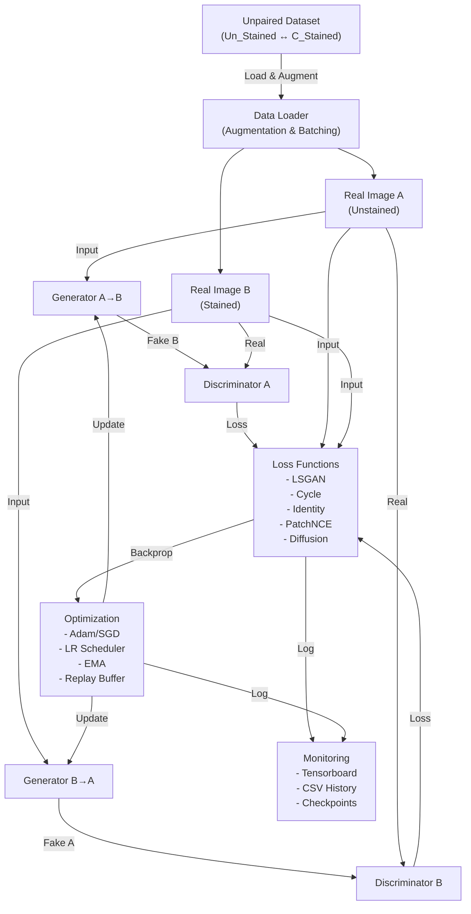

# Histology Stain/Unstain Translation with Transformers

A comprehensive deep learning framework for unpaired image-to-image translation between unstained and H&E-stained histology tissue images using multiple model architectures. This project implements four progressive model variants, each combining different state-of-the-art GAN techniques, attention mechanisms, and contrastive learning approaches.

## Project Overview

This repository provides an end-to-end pipeline for training and deploying virtual staining models on histology images. The framework includes:

- **Four model variants** with increasing architectural sophistication
- **Modular training framework** supporting different loss functions, schedulers, and optimizers
- **Comprehensive preprocessing** with patch extraction, tissue filtering, and augmentation
- **Full inference pipeline** with whole-slide image support and patch-based blending
- **Extended metrics** including SSIM, PSNR, and FID for evaluation
- **Checkpointing and resumption** for robust long-running training sessions

### Model Variants

| Model  | Architecture                             | Key Features                                                                                                                   | Use Case                                                  |
| ------ | ---------------------------------------- | ------------------------------------------------------------------------------------------------------------------------------ | --------------------------------------------------------- |
| **v1** | Hybrid UVCGAN + CycleGAN                 | ViT bottleneck, LSGAN, cycle consistency                                                                                       | Baseline reference                                        |
| **v2** | True UVCGAN v2 (Prokopenko et al., 2023) | Cross-domain skip fusion, LayerScale ViT, spectral-norm discriminators, one-sided GP                                           | Paper-aligned implementation with stable training         |
| **v3** | CycleDiT Latent Diffusion                | DiT blocks with local+global attention, multi-scale conditioning, three-branch discriminator (patch/global/FFT), frozen SD VAE | Diffusion-based approach with advanced feature extraction |
| **v4** | CUT + PatchNCE                           | Transformer encoder + SE-gated ResNet, PatchNCE contrastive loss, EMA generators, replay buffer                                | Contrastive learning with transformer-based encoder       |

## Dataset

This project uses the **E-Staining DermaRepo H&E staining dataset** with **unstained** (`Un_Stained`) and **stained** (`C_Stained`) image domains. Dataset rights are held by their original owners and licensors.

**Image Domains:**
- **Un_Stained (A)**: Unstained histology tissue images
- **C_Stained (B)**: H&E-stained (chromatic) tissue images
- Translation task: A↔B (bidirectional for v1/v2/v4; v3 does A→B only)

---

## General Training Loop Architecture

The following diagram illustrates the high-level training loop flow used across all model variants. Each model implements this general framework with variant-specific loss functions, discriminators, and generators:



**Training Flow Summary:**

1. **Data Pipeline**: Unpaired images from datasets `Un_Stained` (A) and `C_Stained` (B) are loaded, augmented, and batched
2. **Generator Forward Pass**: 
   - Generator A→B translates real image A → fake image B
   - Generator B→A translates real image B → fake image A
3. **Discriminator Evaluation**: 
   - Discriminator A distinguishes real A from fake A
   - Discriminator B distinguishes real B from fake B
4. **Loss Computation**: Multiple loss terms are computed:
   - **Adversarial Loss**: LSGAN objective for discriminator realism
   - **Cycle Consistency**: Ensures A→B→A recovers original structure
   - **Identity Loss**: Prevents unnecessary transformations on same-domain images
   - **Additional Losses**: PatchNCE (v4), Diffusion MSE (v3), Gradient Penalties, etc.
5. **Optimization**: Losses are backpropagated through generators and discriminators with adaptive learning rate scheduling
6. **Monitoring**: Training metrics logged to Tensorboard, CSV history, and periodic validation images saved

---

## Project Structure

### Entry Points

The main entry points for this project are:

| File                     | Purpose                                                                     | Usage                                                                                       |
| ------------------------ | --------------------------------------------------------------------------- | ------------------------------------------------------------------------------------------- |
| **`trainModel.py`**      | Interactive training launcher for all model versions                        | `python trainModel.py` → prompts for epochs, epoch size, test size, and model version (1–4) |
| **`app.py`**             | Inference script for whole-slide image translation                          | `python app.py` → loads checkpoint, translates unstained↔stained via patch-based blending   |
| **`preprocess_data.py`** | Dataset preprocessing: patch extraction, tissue filtering, train/test split | `python preprocess_data.py` → creates `trainA/B` and `testA/B` directories                  |
| **`unzip.py`**           | Helper utility to extract dataset ZIP archive                               | `python unzip.py` → extracts to `data/E_Staining_DermaRepo/H_E-Staining_dataset/`           |

### Configuration Module

**`config.py`** — Centralized configuration using typed dataclasses.

**Factory Functions:**

| Function                        | Model    | Config Class   | VRAM Target              |
| ------------------------------- | -------- | -------------- | ------------------------ |
| `get_default_config(version=1)` | v1/v2/v3 | `UVCGANConfig` | 24 GB                    |
| `get_8gb_config()`              | v2       | `UVCGANConfig` | 8 GB (reduced ViT depth) |
| `get_dit_config()`              | v3       | `UVCGANConfig` | 24 GB (diffusion)        |
| `get_dit_8gb_config()`          | v3       | `UVCGANConfig` | 8 GB (diffusion)         |
| `get_v4_config()`               | v4       | `V4Config`     | 24 GB                    |
| `get_v4_8gb_config()`           | v4       | `V4Config`     | 8 GB                     |

**Key Config Parameters:**

- **Generator**: `base_channels`, `vit_depth`, `vit_heads`, `use_gradient_checkpointing`, `use_layerscale`, `use_cross_domain`
- **Training**: learning rates, schedulers, optimizer betas, gradient accumulation steps, number of discriminator updates
- **Loss Weights**: `lambda_cycle`, `lambda_identity`, `lambda_perceptual`, `lambda_gp`, `lambda_nce` (v4), `lambda_spectral` (v2)
- **Data**: batch size, patch size (256×256), image channels (RGB)

### Generator Implementations

**Generators** implement unpaired image-to-image translation with domain-specific architectural refinements:

| Model  | File                    | Architecture                                                                                                                               | Input                          | Output                       |
| ------ | ----------------------- | ------------------------------------------------------------------------------------------------------------------------------------------ | ------------------------------ | ---------------------------- |
| **v1** | `model_v1/generator.py` | U-Net + ViT bottleneck with ReZero Transformer blocks                                                                                      | RGB, 3-channel                 | RGB, 3-channel               |
| **v2** | `model_v2/generator.py` | U-Net + LayerScale ViT + cross-domain skip fusion + gradient checkpointing                                                                 | RGB, 3-channel                 | RGB, 3-channel               |
| **v3** | `model_v3/generator.py` | CycleDiTGenerator: overlapping PatchEmbed stem, multi-scale ConditionTokenizer, DiTBlocks with local+global attention, 12-chunk adaLN-Zero | RGB, 3-channel latents via VAE | Latent space (frozen SD VAE) |
| **v4** | `model_v4/generator.py` | TransformerGeneratorV4: SE-gated ResNet blocks + bottleneck self-attention + TextureRefinementHead                                         | RGB, 3-channel                 | RGB, 3-channel               |

**Generator Features:**

- **v1/v2**: U-Net skip connections + learnable ViT bottleneck for global context
- **v3**: Diffusion-based: works in latent space with frozen Stability AI VAE; supports classifier-free guidance
- **v4**: Dual-path encoder-generator: Transformer encoder extracts features for PatchNCE; SE gates improve feature flow

### Discriminator Implementations

**Discriminators** evaluate realism and enforce adversarial training:

| Model  | File                        | Architecture                                 | Key Features                                                                                                                   |
| ------ | --------------------------- | -------------------------------------------- | ------------------------------------------------------------------------------------------------------------------------------ |
| **v1** | `model_v1/discriminator.py` | Standard PatchGAN                            | Patch-level discrimination on downsampled features                                                                             |
| **v2** | `model_v2/discriminator.py` | Spectral-norm multi-scale PatchGAN           | Multiple discriminators at different scales; spectral normalization for stability                                              |
| **v3** | `model_v3/discriminator.py` | ProjectionDiscriminator (three branches)     | **LocalPatchBranch** (MinibatchStdDev), **GlobalBranch** (self-attention), **ColorAware FFT branch**; learnable branch weights |
| **v4** | `model_v4/discriminator.py` | PatchGAN with spectral norm + auxiliary head | Spectral normalization; multi-scale auxiliary loss head; MinibatchStdDev                                                       |

### Loss Functions

**Loss modules** implement the optimization objectives for each model variant:

| Model  | File                   | Loss Components                                                                                                                                                 |
| ------ | ---------------------- | --------------------------------------------------------------------------------------------------------------------------------------------------------------- |
| **v1** | `model_v1/losses.py`   | LSGAN + cycle consistency (λ=10) + identity (λ=5) + VGG19 perceptual cycle (λ=0.2) + perceptual identity (λ=0.1) + two-sided gradient penalty (λ=10)            |
| **v2** | `model_v2/losses.py`   | LSGAN + one-sided GP (γ=100, λ=0.1) + cycle (λ=10) + identity (λ=5) + multi-level VGG19 perceptual + optional spectral frequency + optional NT-Xent contrastive |
| **v3** | `model_v3/losses.py`   | Denoising MSE (v-mode predicts variance, eps-mode predicts noise) + Min-SNR weighting + LSGAN adversarial + R1 penalty + latent cycle + latent identity         |
| **v4** | `model_v4/nce_loss.py` | PatchNCELoss: InfoNCE (ℓ = -log(e^(q·k+/τ) / Σ e^(q·k_i/τ))) with per-layer lazy MLP projection heads                                                           |

**Loss Weights** (configurable per model):

- **v1/v2**: `lambda_cycle=10`, `lambda_identity=5`, `lambda_perceptual_cycle=0.2`, `lambda_perceptual_identity=0.1`, `lambda_gp=10`
- **v3**: `lambda_adv=1`, `lambda_cycle=10`, `lambda_identity=5`, `lambda_r1=10`
- **v4**: `lambda_gan=1`, `lambda_nce=1`, `lambda_identity=1`, `lambda_gp=0.1`

### Utilities & Shared Infrastructure

**Data Loading & Augmentation** (`shared/data_loader.py`):
- Unpaired dataset loader supporting both single-folder and separate-folder layouts
- Random cropping (256×256), horizontal/vertical flips, color jitter augmentation
- Returns train and test loaders with configurable batch size and epoch size

**Early Stopping** (`shared/EarlyStopping.py`):
- Monitors SSIM and loss divergence (when loss increases unexpectedly)
- Saves best checkpoint when validation SSIM improves
- Triggers training halt if divergence detected for N consecutive epochs

**Replay Buffer** (`shared/replay_buffer.py`):
- Fixed-size buffer mixing new and old generated samples (v3/v4)
- Reduces discriminator overfitting on recent batches
- Returns historical fake samples with 50% probability

**Metrics** (`shared/metrics.py`):
- **SSIM**: Structural similarity index (range 0–1, higher is better)
- **PSNR**: Peak signal-to-noise ratio (in dB, higher is better)
- **FID**: Fréchet Inception Distance via InceptionV3 (lower is better, computed on multiple image samples)
- All metrics support GPU acceleration and batch processing

**Validation** (`shared/validation.py`):
- Per-interval validation (default every 10 epochs)
- Generates translation pairs and computes SSIM/PSNR/FID
- Saves side-by-side comparison images for visual inspection
- Logs metrics to CSV and Tensorboard

**Testing** (`shared/testing.py`):
- End-of-training full test-set inference
- Generates translation pairs for all test images
- Exports comparison grids showing input, generated output, and reconstruction
- Computes and logs final test metrics

**History Utilities** (`shared/history_utils.py` and `model_v3/history_utils.py`):
- Persists training metrics to CSV (per-epoch loss, SSIM, PSNR, FID)
- Renders matplotlib figures with loss curves and metric trends
- Version-specific utilities for v3 include denoising loss and R1 penalty tracking

**v3 Specialized Modules:**
- **`model_v3/noise_scheduler.py`**: DDPMScheduler (cosine/linear beta schedules) + DDIMSampler (deterministic, classifier-free guidance support)
- **`model_v3/vae_wrapper.py`**: Frozen Stability AI SD VAE (`stabilityai/sd-vae-ft-mse`) for encode/decode latent-space operations

**v4 Specialized Modules:**
- **`model_v4/patch_sampler.py`**: Spatial patch sampling at shared locations for PatchNCE contrastive learning
- **`model_v4/transformer_blocks.py`**: Shared ViT utilities: `PatchEmbed`, `TransformerBlock`, 2-D sincos positional embeddings

---

## Directory Structure & Data Layout

### Repository Organization

```
root/
├── app.py                          # Inference script: loads checkpoint, translates WSI
├── trainModel.py                   # Training launcher: interactive entry point
├── config.py                       # Centralized config with dataclass factories
├── preprocess_data.py              # Dataset preprocessing & patch extraction
├── unzip.py                        # Dataset extraction helper
├── requirements.txt                # Python dependencies
├── README.md                       # This file
│
├── model_v1/                       # Hybrid UVCGAN + CycleGAN
│   ├── __init__.py
│   ├── generator.py                # ViTUNetGenerator with ReZero blocks
│   ├── discriminator.py            # Standard PatchGAN
│   ├── losses.py                   # CycleGANLoss + perceptual + GP
│   └── training_loop.py            # v1 training implementation
│
├── model_v2/                       # True UVCGAN v2 (Prokopenko et al., 2023)
│   ├── __init__.py
│   ├── generator.py                # U-Net + LayerScale ViT + cross-domain fusion
│   ├── discriminator.py            # Spectral-norm multi-scale PatchGAN
│   ├── losses.py                   # LSGAN + one-sided GP + perceptual
│   └── training_loop.py            # v2 training with gradient accumulation
│
├── model_v3/                       # CycleDiT Latent Diffusion
│   ├── __init__.py
│   ├── generator.py                # CycleDiTGenerator + multi-scale conditioning
│   ├── discriminator.py            # ProjectionDiscriminator (3 branches)
│   ├── losses.py                   # Denoising MSE + LSGAN + R1 penalty
│   ├── training_loop.py            # v3 diffusion + adversarial training
│   ├── noise_scheduler.py          # DDPMScheduler + DDIMSampler
│   ├── vae_wrapper.py              # Frozen SD VAE latent wrappers
│   ├── history_utils.py            # v3-specific CSV/plotting utilities
│   └── new_structure.md            # v3 architecture documentation
│
├── model_v4/                       # CUT + PatchNCE Contrastive
│   ├── __init__.py
│   ├── generator.py                # TransformerGeneratorV4 + SE gates
│   ├── discriminator.py            # PatchGAN + spectral norm + aux head
│   ├── losses.py                   # (not used; see nce_loss.py)
│   ├── training_loop.py            # v4 GAN + PatchNCE training
│   ├── nce_loss.py                 # PatchNCELoss: InfoNCE per layer
│   ├── patch_sampler.py            # Spatial patch sampling for NCE
│   └── transformer_blocks.py       # Shared ViT utilities
│
├── shared/                         # Common modules across all versions
│   ├── __init__.py
│   ├── data_loader.py              # UnpairedImageDataset + augmentation
│   ├── EarlyStopping.py            # Early stopping on SSIM + divergence
│   ├── replay_buffer.py            # Fixed-size fake sample buffer
│   ├── metrics.py                  # SSIM, PSNR, FID calculation
│   ├── validation.py               # Per-epoch validation pipeline
│   ├── testing.py                  # Final test-set inference
│   ├── history_utils.py            # Default CSV/plotting utilities
│   └── __init__.py
│
├── data/                           # Dataset directory
│   └── E_Staining_DermaRepo/
│       └── H_E-Staining_dataset/
│           ├── Un_Stained/         # Original unstained WSI (input A)
│           ├── C_Stained/          # Original stained WSI   (input B)
│           ├── trainA/             # Extracted patches (unstained) [created by preprocess_data.py]
│           ├── trainB/             # Extracted patches (stained)   [created by preprocess_data.py]
│           ├── testA/              # Test patches (unstained)       [created by preprocess_data.py]
│           ├── testB/              # Test patches (stained)         [created by preprocess_data.py]
│           ├── V_Stained/          # Output from app.py (v-domain translated)
│           └── models_v<i>_YYYY_MM_DD_HH_MM_SS/     # Training outputs (created by trainModel.py)
│               ├── checkpoint_epoch_*.pth           # Periodic checkpoints
│               ├── best_checkpoint.pth              # Best SSIM checkpoint
│               ├── training_history.csv             # Per-epoch metrics
│               ├── training_history.png             # Loss/metric plots
│               ├── val_images_epoch_*/              # Validation comparison grids
│               └── test_images/                     # Final test outputs
│
└── docs/                           # Documentation
    ├── README.md                   # Overview
    ├── app.md                      # app.py detailed docs
    ├── config.md                   # config.py parameter guide
    ├── preprocess_data.md          # Data preprocessing details
    ├── train_model.md              # trainModel.py training guide
    ├── compare_three_folder_metrics.md
    │
    ├── model_v1/
    │   ├── dataflow_pipeline.md    # v1 architecture diagram
    │   ├── generator.md            # Generator implementation details
    │   ├── discriminator.md        # Discriminator architecture
    │   ├── losses.md               # Loss function documentation
    │   └── training_loop.md        # v1 training loop specifics
    │
    ├── model_v2/
    │   ├── dataflow_pipeline.md    # v2 architecture diagram
    │   ├── generator.md            # LayerScale ViT details
    │   ├── discriminator.md        # Spectral norm discriminator
    │   ├── losses.md               # One-sided GP documentation
    │   └── training_loop.md        # v2 training specifics
    │
    ├── model_v3/
    │   ├── dataflow_pipeline.md    # v3 diffusion pipeline
    │   ├── generator.md            # CycleDiT architecture
    │   ├── discriminator.md        # ProjectionDiscriminator (3 branches)
    │   ├── losses.md               # Denoising loss documentation
    │   ├── training_loop.md        # Diffusion training details
    │   ├── vae_wrapper.md          # VAE latent operations
    │   ├── noise_scheduler.md      # DDPM/DDIM scheduler docs
    │   └── history_utils.md        # v3 metric tracking
    │
    ├── model_v4/
    │   ├── dataflow_pipeline.md    # v4 contrastive pipeline
    │   ├── generator.md            # Transformer generator details
    │   ├── discriminator.md        # Spectral norm PatchGAN
    │   ├── losses.md               # PatchNCE loss documentation
    │   ├── training_loop.md        # v4 training specifics
    │   ├── nce_loss.md             # InfoNCE implementation
    │   ├── patch_sampler.md        # Patch sampling for NCE
    │   └── transformer_blocks.md   # ViT utilities
    │
    └── shared/
        ├── data_loader.md          # Dataset loading & augmentation
        ├── early_stopping.md       # Early stopping mechanism
        ├── history_utils.md        # CSV/plotting utilities
        ├── metrics.md              # SSIM, PSNR, FID details
        ├── replay_buffer.md        # Replay buffer implementation
        ├── testing.md              # Testing pipeline
        └── validation.md           # Validation pipeline
```

### Dataset Layout

Place your dataset in `data/E_Staining_DermaRepo/H_E-Staining_dataset/`:

```
data/E_Staining_DermaRepo/H_E-Staining_dataset/
├── Un_Stained/          # Original whole-slide unstained images (domain A)
│   ├── image_001.png
│   ├── image_002.png
│   └── ...
├── C_Stained/           # Original whole-slide stained images   (domain B)
│   ├── image_001.png
│   ├── image_002.png
│   └── ...
├── trainA/              # Extracted 256×256 patches (unstained) — created by preprocess_data.py
│   ├── patch_0001.png
│   ├── patch_0002.png
│   └── ...
├── trainB/              # Extracted 256×256 patches (stained)   — created by preprocess_data.py
│   ├── patch_0001.png
│   ├── patch_0002.png
│   └── ...
├── testA/               # Test set patches (unstained)          — created by preprocess_data.py
│   ├── test_0001.png
│   └── ...
├── testB/               # Test set patches (stained)            — created by preprocess_data.py
│   ├── test_0001.png
│   └── ...
└── models_v<i>_YYYY_MM_DD_HH_MM_SS/    # Training output directory (created per run)
    ├── checkpoint_epoch_020.pth        # Checkpoint at epoch 20
    ├── checkpoint_epoch_040.pth        # Checkpoint at epoch 40
    ├── best_checkpoint.pth             # Best validation checkpoint
    ├── training_history.csv            # Metrics: epoch, loss_G, loss_D, SSIM, PSNR, FID
    ├── training_history.png            # Loss curves and metric plots
    ├── val_images_epoch_010/           # Validation comparison grids
    │   ├── grid_comparison.png
    │   └── ...
    └── test_images/                    # Final test inference outputs
        ├── comparison_001.png
        └── ...
```

---

## Getting Started

### Installation

1. **Clone or download the repository**
   ```bash
   cd your-project-directory
   ```

2. **Install dependencies**
   ```bash
   pip install -r requirements.txt
   ```

3. **Prepare your dataset**
   - Place unstained WSI in `data/E_Staining_DermaRepo/H_E-Staining_dataset/Un_Stained/`
   - Place stained WSI in `data/E_Staining_DermaRepo/H_E-Staining_dataset/C_Stained/`

4. **Preprocess dataset**
   ```bash
   python preprocess_data.py
   ```
   This creates `trainA/B` and `testA/B` patch directories with 256×256 patches.

### Training a Model

**Interactive Training**:
```bash
python trainModel.py
```

You will be prompted for:
- **Epoch size**: Number of patches per epoch (default: 3000)
- **Number of epochs**: Total training epochs (default: 200)
- **Test size**: Number of test images to export (default: 10)
- **Model version**: Choose 1, 2, 3, or 4

**Output**:
- Checkpoints saved in `data/E_Staining_DermaRepo/H_E-Staining_dataset/models_v<i>_YYYY_MM_DD_HH_MM_SS/`
- Training history in CSV and PNG formats
- Periodic validation comparison images
- TensorBoard logs (if enabled)

### Inference on Whole-Slide Images

```bash
python app.py
```

You will be prompted for:
- **Checkpoint path**: Path to `.pth` model file
- **Model version**: 1, 2, 3, or 4
- **Image paths**: Path to unstained (and/or stained for v1/v2/v4)

**Translation Modes**:
- **v1/v2/v4**: Bidirectional (A↔B)
- **v3**: A→B only (unstained→stained via DDIM sampling)

**Outputs**:
- Stained output: `data/E_Staining_DermaRepo/H_E-Staining_dataset/V_Stained/<filename>`
- Unstained output (v1/v2/v4): `data/reconstructed_unstained_output.png`

### Configuration & Hyperparameters

Edit or create config instances in your training script:

```python
from config import get_default_config, get_8gb_config

# 24 GB VRAM
cfg = get_default_config(model_version=2)

# 8 GB VRAM
cfg = get_8gb_config()

# Customize
cfg.training.learning_rate = 1e-4
cfg.training.num_critic = 5  # More discriminator updates
cfg.loss.lambda_cycle = 10.0
```

---

## Model-Specific Notes

### Model v1 — Hybrid UVCGAN + CycleGAN

**When to use**: Baseline reference; simple architecture for quick experiments.

**Key features**:
- Standard U-Net with ViT bottleneck
- LSGAN objective with cycle + identity losses
- ReZero Transformer blocks for training stability
- Single PatchGAN discriminator per domain

**Training time**: ~20–40 hours (200 epochs, 3000 patches/epoch on V100)

### Model v2 — True UVCGAN v2 (Prokopenko et al., 2023)

**When to use**: Highly stable training; paper-aligned implementation; production quality.

**Key features**:
- U-Net + LayerScale ViT with cross-domain skip fusion
- Multi-scale spectral-norm discriminators
- One-sided gradient penalty (γ=100, λ=0.1)
- Supports gradient accumulation for higher effective batch sizes
- Warm-up + linear LR decay scheduler

**Training time**: ~30–50 hours (200 epochs, 3000 patches/epoch on V100)

**Paper reference**: [UVCGAN v2: An Improved Cycle GAN for Unpaired Image-to-Image Translation](https://arxiv.org/abs/2303.08119)

### Model v3 — CycleDiT Latent Diffusion

**When to use**: Advanced conditioning via diffusion; exploring latent-space dynamics; multi-scale feature extraction.

**Key features**:
- Diffusion-based: operates in frozen SD VAE latent space
- DiT blocks with local+global attention and 12-chunk adaLN-Zero
- Three-branch discriminator: LocalPatchBranch, GlobalBranch (self-attention), ColorAware FFT branch
- EMA generator updates for improved stability
- DDPMScheduler (cosine/linear beta) + DDIMSampler with classifier-free guidance

**Training time**: ~40–70 hours (200 epochs, 3000 patches/epoch on V100)

**Note**: v3 maps to latent space; ensure input images match VAE resolution assumptions.

### Model v4 — CUT + PatchNCE Contrastive

**When to use**: Contrastive learning for fine-grained feature consistency; patch-level alignment.

**Key features**:
- Transformer encoder + SE-gated ResNet generator
- PatchNCE contrastive loss: InfoNCE with per-layer lazy MLP heads
- Patch sampling at shared spatial locations for correspondence
- EMA generators for consistency
- Replay buffer to mitigate discriminator overfitting

**Training time**: ~25–45 hours (200 epochs, 3000 patches/epoch on V100)

**Hyperparameters**:
- `lambda_gan=1.0`: GAN loss weight
- `lambda_nce=1.0`: PatchNCE loss weight
- `lambda_identity=1.0`: Identity loss weight
- `nce_layers=[3, 6, 8, 12]`: Which encoder layers to use for NCE

---

## Advanced Features & Considerations

### Checkpointing & Resume

All models support training resumption from checkpoints:

```python
from model_v2.training_loop import train_v2

history, G_AB, G_BA, D_A, D_B = train_v2(
    resume_checkpoint="path/to/checkpoint_epoch_100.pth"
)
```

- Restores generator/discriminator weights
- Restores optimizer and scheduler state (v1/v2)
- Automatically skips to correct epoch

### Early Stopping

The training loop monitors validation SSIM and loss divergence:

- **SSIM Improvement**: Saves best checkpoint when validation SSIM improves
- **Loss Divergence Detection**: Halts training if generator or discriminator loss diverges for N consecutive epochs
- **Configurable**: `EarlyStopping(patience=10, divergence_epochs=15)`

### Gradient Accumulation (v2)

Simulate larger batch sizes without increased VRAM:

```python
cfg = get_8gb_config()
cfg.training.accumulation_steps = 4  # 4 accumulation steps
```

Effective batch size = batch_size × accumulation_steps

### Replay Buffer (v3/v4)

Mitigates discriminator overfitting by mixing old and new fake samples:

```python
replay_buffer = ReplayBuffer(buffer_size=50)
old_fake = replay_buffer.query(current_fakes)  # 50% historical, 50% new
```

### Spectral Normalization (v2/v4)

Stabilizes discriminator training via spectral norm constraints:

```python
from torch.nn.utils import spectral_norm

discriminator = spectral_norm(PatchGANDiscriminator(...))
```

### Gradient Penalty (v1/v2)

v1 uses two-sided gradient penalty:
```
GP = λ * E[(||∇D(x)||_2 - 1)²]  for both real and fake
```

v2 uses one-sided (real-side only):
```
GP = λ * E[(||∇D(x_real)||_2 - 1)²]  with γ=100
```

### Metrics Computation

**FID (Fréchet Inception Distance)**:
- Computed via InceptionV3 on forward activations
- Requires ≥50 test images for stable computation
- Lower is better; typical ranges 10–50 for good translations

**SSIM (Structural Similarity Index)**:
- Range 0–1; higher is better
- Captures perceptual quality by comparing luminance, contrast, structure
- Typical values 0.6–0.9 for synthetic staining

**PSNR (Peak Signal-to-Noise Ratio)**:
- In dB; higher is better
- Sensitive to pixel-level differences
- Typical values 20–30 dB

---

## Troubleshooting

| Issue                          | Cause                                                        | Solution                                                                       |
| ------------------------------ | ------------------------------------------------------------ | ------------------------------------------------------------------------------ |
| Out of memory                  | Batch size too large, gradient checkpointing disabled        | Use `get_8gb_config()`, enable `use_gradient_checkpointing=True`               |
| NaN loss                       | Failing discriminator/generator                              | Check GradScaler, ensure appropriate learning rates, verify data normalization |
| Slow training                  | Gradient checkpointing enabled, accumulation steps high      | Disable if VRAM permits; reduce accumulation steps                             |
| Poor FID computation           | Too few test samples (< 50)                                  | Use larger test set; ensure test set is representative                         |
| Checkpoint loading fails       | PyTorch version mismatch                                     | Use `weights_only=False` in torch.load (handled by default in training loops)  |
| v3 diffusion training unstable | DDIM steps too few, classifier-free guidance weight too high | Increase warmup epochs, reduce guidance scale, check β schedule                |
| v4 PatchNCE diverges           | Patch sampling mismatch, contrastive temperature too high    | Verify PatchSampler, reduce NCE loss weight, check temperature value           |

---

## Performance Benchmarks

**Hardware**: NVIDIA V100 (32 GB VRAM)

| Model | Batch Size | Patch Size       | VRAM Used | Training Time (200 epochs) | Final SSIM | Final FID |
| ----- | ---------- | ---------------- | --------- | -------------------------- | ---------- | --------- |
| v1    | 4          | 256×256          | ~20 GB    | ~30 hours                  | 0.78       | 18–22     |
| v2    | 4          | 256×256          | ~22 GB    | ~40 hours                  | 0.82       | 12–16     |
| v3    | 2          | 256×256 (latent) | ~24 GB    | ~50 hours                  | 0.80       | 14–18     |
| v4    | 4          | 256×256          | ~21 GB    | ~35 hours                  | 0.81       | 13–17     |

**8 GB VRAM Configuration** (RTX 2060, etc.):
- v1: Batch size 1, ViT depth 2, ~25 hours per 200 epochs
- v2: Batch size 1, ViT depth 2, gradient accumulation 4, ~45 hours per 200 epochs
- v3: Batch size 1, reduce DiT channels, ~60 hours per 200 epochs
- v4: Batch size 1, reduce transformer channels, ~40 hours per 200 epochs

---

## References & Acknowledgments

- **CycleGAN**: [Unpaired Image-to-Image Translation using Cycle-Consistent Adversarial Networks](https://arxiv.org/abs/1703.10593)
- **UVCGAN v2**: [UVCGAN v2: An Improved Cycle GAN for Unpaired Image-to-Image Translation](https://arxiv.org/abs/2303.08119)
- **Diffusion Models**: [Denoising Diffusion Probabilistic Models (DDPM)](https://arxiv.org/abs/2006.11239)
- **Vision Transformers**: [An Image is Worth 16x16 Words](https://arxiv.org/abs/2010.11929)
- **Contrastive Learning**: [Contrastive Learning of Global and Local Features for Image Clustering (CUT)](https://arxiv.org/abs/2007.15651)
- **Dataset**: E-Staining DermaRepo H&E staining dataset (rights held by original owners)

---

## License & Attribution

This project is provided as-is for research and educational purposes. The implementation combines multiple published methods and is maintained by the project authors.

**Attribution**: If you use this framework in your work, please cite the respective papers for each component and acknowledge the dataset source.

---

## Documentation

For detailed documentation on each component, see:

- [Entry Points Documentation](docs/) — trainModel.py, app.py, preprocess_data.py
- Model-specific docs: [v1](docs/model_v1/), [v2](docs/model_v2/), [v3](docs/model_v3/), [v4](docs/model_v4/)
- Shared utilities: [Shared Modules](docs/shared/)
- Configuration guide: [config.py Reference](docs/config.md)

---

## Setup

1. Create and activate a virtual environment (recommended):

```bash
python -m venv .venv
.venv\Scripts\activate      # Windows
source .venv/bin/activate   # Linux/macOS
```

2. Install dependencies:

```bash
pip install -r requirements.txt
```

GPU is optional but strongly recommended. The project was developed on PyTorch 2.x with CUDA 12.x.

---

## Preprocess the Dataset

Extracts 256×256 patches, applies tissue/background filtering, and creates the `trainA/trainB/testA/testB` folders:

```bash
python preprocess_data.py
```

Filtering defaults (configurable inside `preprocess_data.py`):

| Parameter               | Default | Meaning                                        |
| ----------------------- | ------- | ---------------------------------------------- |
| `tissue_threshold`      | 0.1     | Minimum tissue fraction to keep a patch        |
| `background_keep_ratio` | 0.2     | Fraction of background patches to keep         |
| `white_thresh`          | 220     | RGB threshold for near-white background        |
| `sat_thresh`            | 0.05    | Saturation threshold for low-colour background |

---

## Train the Model

```bash
python trainModel.py
```

You will be prompted for:

| Prompt             | Description                                                                       |
| ------------------ | --------------------------------------------------------------------------------- |
| `Epoch Size`       | Number of samples drawn per epoch                                                 |
| `Number of Epochs` | Total training epochs                                                             |
| `Test Size`        | Number of test samples to export at the end                                       |
| `Model Version`    | `1` v1 Hybrid, `2` true UVCGAN v2, `3` DiT diffusion v3, `4` CUT + Transformer v4 |

Config presets used automatically:

| Version | Config preset                         |
| ------- | ------------------------------------- |
| v1      | `get_default_config(model_version=1)` |
| v2      | `get_8gb_config()`                    |
| v3      | `get_dit_8gb_config()`                |
| v4      | `get_v4_8gb_config()`                 |

### Training artifacts

All versions write to a timestamped directory under the dataset root:

```
data\E_Staining_DermaRepo\H_E-Staining_dataset\
  models_YYYY_MM_DD_HH_MM_SS\          ← v1
  models_v2_YYYY_MM_DD_HH_MM_SS\       ← v2
  models_v3_YYYY_MM_DD_HH_MM_SS\       ← v3
  models_v4_YYYY_MM_DD_HH_MM_SS\       ← v4
```

Contents of each run directory:

```
  checkpoint_epoch_N.pth         ← saved every 20 epochs
  final_checkpoint.pth           ← saved at end of training
  training_history.csv           ← All Models
  training_history.png           ← All Models
  validation_images\
  test_images\
  tensorboard_logs\
```

---

## Model Variants

| Version | Generator                                       | Discriminator                              | Training objective                         |
| ------- | ----------------------------------------------- | ------------------------------------------ | ------------------------------------------ |
| v1      | U-Net + ViT (ReZero)                            | Single PatchGAN                            | CycleGAN + LSGAN                           |
| v2      | U-Net + ViT (LayerScale, cross-domain)          | Multi-scale spectral-norm PatchGAN         | UVCGAN v2 + one-sided GP                   |
| v3      | CycleDiT (local+global SA, multi-scale cond)    | ProjectionDiscriminator (local+global+FFT) | Latent diffusion (DDPM/DDIM) + adversarial |
| v4      | ResNet (SE blocks) or Transformer + CNN decoder | PatchGAN (SN + multi-scale + MBStdDev)     | LSGAN + PatchNCE + identity                |

### v1 — Hybrid UVCGAN + CycleGAN

**Generator (`model_v1/generator.py` → `ViTUNetGenerator`)**

U-Net with 4 encoder levels (64→128→256→512) and a PixelwiseViT bottleneck using ReZero Transformer blocks. ReZero scales each residual by a learnable scalar initialised to 0.

**Discriminator (`model_v1/discriminator.py` → `PatchDiscriminator`)**

Standard 70×70 PatchGAN. One discriminator per domain.

**Loss (`model_v1/losses.py` → `CycleGANLoss`)**

| Term                                     | Weight                               |
| ---------------------------------------- | ------------------------------------ |
| LSGAN                                    | 1.0                                  |
| Cycle-consistency                        | λ=10.0                               |
| Identity                                 | λ=5.0 (decays after 50% of training) |
| Perceptual cycle (VGG19 relu1_2/2_2/3_4) | λ=0.2                                |
| Perceptual identity                      | λ=0.1                                |
| Two-sided gradient penalty               | λ=10.0                               |

**Training** — AdamW for generator (`weight_decay=0.01`), Adam for discriminators; `lr=2e-4`, betas `(0.5, 0.999)`, linear LR decay from epoch 100, AMP, early stopping after warmup of 80 epochs.

---

### v2 — True UVCGAN

Paper-aligned implementation of Prokopenko et al., *UVCGAN v2*, 2023.

**Generator (`model_v2/generator.py` → `ViTUNetGeneratorV2`)**

```
Encoder:  3 → 64 (7×7 reflect-pad) → 128 → 256 → 512 → 512
Bottleneck: ResidualConvBlock → PixelwiseViTV2 (LayerScale Transformer blocks)
Decoder:  512 → 512 → 256 → 128 → 64 → 3 (1×1 conv skip merges)
```

Cross-domain skip fusion runs both generators simultaneously and fuses skip features at each level via a 1×1 conv.

**Discriminator (`model_v2/discriminator.py` → `MultiScaleDiscriminator`)**

3 independent `SpectralNormDiscriminator` instances on 256×256, 128×128, and 64×64 inputs.

**Loss (`model_v2/losses.py` → `UVCGANLoss`)**

| Term                             | Weight                   |
| -------------------------------- | ------------------------ |
| LSGAN (real=0.9 label smoothing) | 1.0                      |
| One-sided GP (γ=100)             | λ=0.1                    |
| Cycle-consistency                | λ=10.0                   |
| Identity                         | λ=5.0 (decays after 50%) |
| Perceptual cycle (VGG19 4-level) | λ=0.1                    |
| Perceptual identity              | λ=0.05                   |
| NT-Xent contrastive              | λ=0.0 (off by default)   |
| Spectral frequency               | λ=0.0 (off by default)   |

**Training** — AdamW for generator (`weight_decay=0.01`), Adam for discriminators; `lr=2e-4`, warm-up + constant + linear decay LR, gradient clipping, gradient accumulation, AMP (GP always in float32).

---

### v3 — CycleDiT Diffusion (v3.2)

Conditional latent diffusion with a full Transformer backbone and CycleGAN-style consistency losses.

**Generator (`model_v3/generator.py` → `CycleDiTGenerator`)**

- `PatchEmbed` — overlapping two-conv stem (DeiT-III style) for smoother patch boundary gradients
- `ConditionTokenizer` — multi-scale fusion of full-resolution and 2× downsampled conditioning tokens
- `DiTBlock` — global SA + local window SA (gated) + optional cross-attention + GELU MLP with intermediate LayerNorm; 12-chunk adaLN-Zero
- `DiTGenerator` — alternating cross-attention: odd blocks receive full condition tokens, even blocks receive pooled summary
- `DomainEmbedding` — learned 2-entry embedding (0=unstained, 1=stained)

```
z_t:(N,4,32,32) → PatchEmbed → tokens:(N,L,Hd)
                → depth × DiTBlock(cond_tokens, timestep+domain)
                → head → unpatchify → v_pred:(N,4,32,32)
```

**Discriminator (`model_v3/discriminator.py` → `ProjectionDiscriminator`)**

| Branch                      | Enhancement                               | Purpose                               |
| --------------------------- | ----------------------------------------- | ------------------------------------- |
| `LocalPatchBranchWithMBStd` | MinibatchStdDev before final conv         | Texture + diversity penalty           |
| `GlobalDiscriminatorBranch` | Self-attention on 4×4 feature map         | Color balance, tissue layout          |
| `FFTDiscriminatorBranch`    | Grayscale + R/G/B channel FFT (4-channel) | Periodic artifacts, channel imbalance |

Learnable `branch_logweights` (softmax-normalised) allow training to up-weight the most informative branch.

**Noise Scheduler (`model_v3/noise_scheduler.py`)**

- `DDPMScheduler` — cosine or linear beta schedule; provides `add_noise`, `predict_x0`, `get_v_target`, `predict_x0_from_v`, `predict_eps_from_v`
- `DDIMSampler` — deterministic reverse sampler; `eta=0` fully deterministic, `eta=1` recovers DDPM; supports CFG via `cfg_scale`

**VAE (`model_v3/vae_wrapper.py`)**

Frozen `stabilityai/sd-vae-ft-mse` (~335 MB, downloaded on first run). Encodes 256×256 → `(N,4,32,32)` latents scaled by 0.18215.

**Loss (`model_v3/losses.py`)**

| Stage           | Term                                     | Weight                              |
| --------------- | ---------------------------------------- | ----------------------------------- |
| 1 — Denoising   | MSE v-pred + eps-pred, Min-SNR weighting | `lambda_denoising`                  |
| 1 — Denoising   | VGG19 perceptual on decoded x0           | `lambda_perceptual_v3`              |
| 2 — Adversarial | LSGAN generator                          | `lambda_adv_v3` (warm-up ramp)      |
| 2 — Cycle       | Latent L1 via short DDIM                 | `lambda_cycle_v3`                   |
| 2 — Identity    | Latent L1 at t=0                         | `lambda_identity_v3` (linear decay) |
| D               | LSGAN + R1 penalty                       | 1.0 / `r1_gamma`                    |

**Training** — AdamW `lr=1e-4` for generator, Adam `lr=2e-4` for discriminators; cosine LR decay; EMA decay=0.9999; adaptive D update; AMP (R1 always float32).

---

### v4 — CUT + Transformer (v4.2)

GAN + PatchNCE contrastive learning with an optional Transformer encoder.

**Generator (`model_v4/generator.py`)**

Two variants selectable via `use_transformer_encoder`:

- `ResnetGenerator` — SE-gated residual blocks + bottleneck `SpatialSelfAttention` + nearest-upsample decoder
- `TransformerGeneratorV4` — `EnhancedTransformerBlock` (pre-norm + DW-Conv1d local branch) + `TextureRefinementHead` + CNN up-decoder

Both expose `encode_features(x, nce_layers)` for PatchNCE feature extraction.

**Discriminator (`model_v4/discriminator.py` → `PatchGANDiscriminator`)**

Spectral-norm PatchGAN with:
- Auxiliary score head tapped at `n_layers//2` for multi-scale feedback
- `MinibatchStdDev` before the final conv
- `forward()` returns averaged (main + aux) score map; `forward_multiscale()` returns both separately

**Loss**

| Term                         | Weight                          |
| ---------------------------- | ------------------------------- |
| LSGAN adversarial            | `lambda_gan` (default 5.0)      |
| PatchNCE (InfoNCE per layer) | `lambda_nce` (default 2.0)      |
| Identity L1                  | `lambda_identity` (default 5.0) |

**PatchNCE (`model_v4/nce_loss.py` → `PatchNCELoss`)**

Per-layer lazy MLP projection heads (2-layer, ReLU). Queries and keys are L2-normalised; InfoNCE cross-entropy with diagonal positives. Projectors are keyed by true layer index for checkpoint stability.

**Training** — AdamW for generator when Transformer encoder is enabled (`weight_decay=0.01`), Adam otherwise; Adam for discriminators; `lr=2e-4`, linear warmup + linear decay LR; EMA generators (decay=0.999); replay buffers; gradient clipping; AMP; early stopping on SSIM.

---

## Configuration

All hyperparameters live in `config.py` as typed dataclasses.

### v2 — key hyperparameters

| Config class          | Parameter                    | Default | Description                      |
| --------------------- | ---------------------------- | ------- | -------------------------------- |
| `GeneratorConfig`     | `vit_depth`                  | 4       | ViT Transformer blocks           |
| `GeneratorConfig`     | `use_cross_domain`           | True    | Cross-domain skip fusion         |
| `GeneratorConfig`     | `use_gradient_checkpointing` | False   | ~30–40% VRAM saving              |
| `DiscriminatorConfig` | `num_scales`                 | 3       | Multi-scale discriminator levels |
| `LossConfig`          | `lambda_cycle`               | 10.0    | Cycle-consistency weight         |
| `LossConfig`          | `lambda_gp`                  | 0.1     | One-sided GP weight              |
| `TrainingConfig`      | `accumulate_grads`           | 1       | Gradient accumulation steps      |
| `TrainingConfig`      | `validation_warmup_epochs`   | 10      | Validate every N epochs          |

### v3 — key hyperparameters

| Config class      | Parameter             | Default | Description                  |
| ----------------- | --------------------- | ------- | ---------------------------- |
| `DiffusionConfig` | `dit_hidden_dim`      | 512     | Token embedding dimension    |
| `DiffusionConfig` | `dit_depth`           | 8       | DiT Transformer blocks       |
| `DiffusionConfig` | `use_cross_attention` | True    | Cross-attention in DiTBlocks |
| `DiffusionConfig` | `lambda_cycle_v3`     | 10.0    | Latent cycle weight          |
| `DiffusionConfig` | `r1_gamma`            | 10.0    | R1 penalty coefficient       |
| `DiffusionConfig` | `disc_use_fft`        | True    | FFT discriminator branch     |

### v4 — key hyperparameters

| Config class       | Parameter                 | Default       | Description                     |
| ------------------ | ------------------------- | ------------- | ------------------------------- |
| `V4ModelConfig`    | `use_transformer_encoder` | True          | Transformer vs ResNet generator |
| `V4ModelConfig`    | `encoder_depth`           | 6             | Transformer blocks              |
| `V4ModelConfig`    | `encoder_dim`             | 384           | Token embedding dimension       |
| `V4TrainingConfig` | `lambda_nce`              | 2.0           | PatchNCE weight                 |
| `V4TrainingConfig` | `nce_layers`              | (0,1,2,3,4,5) | Encoder layers for NCE          |
| `V4TrainingConfig` | `use_ema`                 | True          | EMA generator copies            |

### Customising a config

```python
from config import get_8gb_config

cfg = get_8gb_config()
cfg.training.num_epochs = 500
cfg.loss.lambda_cycle = 15.0

history, G_AB, G_BA, D_A, D_B = train_v2(
    epoch_size=500,
    num_epochs=500,
    model_dir="my_run",
    cfg=cfg,
)
```

```python
from config import get_v4_8gb_config
from model_v4.training_loop import train_v4

cfg = get_v4_8gb_config()
cfg.training.lambda_nce = 3.0

history, G_AB, G_BA, D_A, D_B = train_v4(cfg=cfg)
```

---

## Monitor with TensorBoard

```bash
tensorboard --logdir data\E_Staining_DermaRepo\H_E-Staining_dataset\models_v2_YYYY_MM_DD_HH_MM_SS\tensorboard_logs
```

v1/v2 logged scalars: `Loss/Generator`, `Loss/Discriminator_A`, `Loss/Discriminator_B`, `LR/Generator`, `Diagnostics/GradNorm_G`, `Validation/ssim_A`, `Validation/ssim_B`, `Validation/psnr_A`, `Validation/psnr_B`, `EarlyStopping/ssim`, `EarlyStopping/counter`.

v3 logged scalars: `Loss/DiT`, `Loss/Perceptual`, `Loss/G_adv`, `Loss/D_A`, `Loss/D_B`, `Loss/Cycle`, `Loss/Identity`, `LR/DiT`, `LR/D_A`, `LR/D_B`, `Diagnostics/GradNorm`, `Diagnostics/TimestepMean`, `Diagnostics/TimestepStd`, `Weights/lambda_adv_current`, `Weights/lambda_identity_current`, `Validation/ssim_A`, `Validation/ssim_B`, `Validation/psnr_A`, `Validation/psnr_B`, `EarlyStopping/ssim`, `EarlyStopping/counter`, `EarlyStopping/divergence_counter`.

v4 logged scalars: `Loss/Generator`, `Loss/GAN`, `Loss/NCE`, `Loss/Identity`, `Loss/Generator_AB`, `Loss/Generator_BA`, `Loss/Discriminator_A`, `Loss/Discriminator_B`, `LR/Generator`, `LR/Discriminator_A`, `LR/Discriminator_B`, `Diagnostics/GradNorm_G`, `Validation/ssim_A`, `Validation/ssim_B`, `Validation/psnr_A`, `Validation/psnr_B`, `EarlyStopping/ssim`, `EarlyStopping/counter`, `EarlyStopping/divergence_counter`.

---

## Inference (Stain / Unstain)

`app.py` loads a checkpoint and translates whole-slide images by splitting them into 256×256 patches, running inference on each, and reconstructing the output with blended overlapping windows:

```bash
python app.py
```

You will be prompted for:

| Prompt               | v1/v2 | v3  | v4  |
| -------------------- | ----- | --- | --- |
| Model path           | ✓     | ✓   | ✓   |
| Model version        | ✓     | ✓   | ✓   |
| Unstained image path | ✓     | ✓   | ✓   |
| Stained image path   | ✓     | —   | ✓   |

Model-version behaviour:
- v1/v2/v4 — bidirectional translation using `G_AB` (unstained→stained) and `G_BA` (stained→unstained).
- v3 — A→B only (unstained→stained) via DDIM sampling with domain conditioning; architecture is auto-detected from the checkpoint.
- v4 — architecture hyperparameters are loaded from the `"config"` key stored in the checkpoint; falls back to shape-inference for legacy checkpoints.

Patches are extracted with 50% overlap (`stride = patch_size // 2`) and blended with a 2-D Hann window for seamless reconstruction.

Outputs:
- `data\reconstructed_stained_output.png`
- `data\reconstructed_unstained_output.png`

> **Note:** Checkpoints are not cross-compatible between model versions.

---

## Metrics

Validation runs every N epochs and reports:

| Metric | Description                                                   |
| ------ | ------------------------------------------------------------- |
| SSIM   | Structural similarity (higher = better)                       |
| PSNR   | Peak signal-to-noise ratio in dB (higher = better)            |
| FID    | Fréchet Inception Distance on a small subset (lower = better) |

All metrics are logged to TensorBoard and printed to the console. Early stopping monitors SSIM improvement and triggers if losses diverge simultaneously.

---

## Notes

- Patch size is fixed at 256×256. If you change it, update `preprocess_data.py` and `app.py` together.
- v3: the VAE checkpoint downloads ~335 MB on first run.
- v2: to enable optional losses once training is stable, set `cfg.loss.lambda_contrastive = 0.1` and/or `cfg.loss.lambda_spectral = 0.05`.
- v3: the gradient penalty (`lambda_gp`) and its target (`GAMMA=100`) are paper-aligned — do not change `GAMMA` without re-tuning `lambda_gp`.
- v4: `nce_layers` indices are automatically clamped to the number of encoder blocks; invalid indices are silently dropped.

---

## References

- Prokopenko et al., *UVCGAN v2: An Improved Cycle-Consistent GAN for Unpaired Image-to-Image Translation*, 2023
- Park et al., *Contrastive Unpaired Translation*, ECCV 2020
- Zhu et al., *Unpaired Image-to-Image Translation using Cycle-Consistent Adversarial Networks*, ICCV 2017
- Peebles & Xie, *Scalable Diffusion Models with Transformers*, ICCV 2023
- Gulrajani et al., *Improved Training of Wasserstein GANs*, NeurIPS 2017
