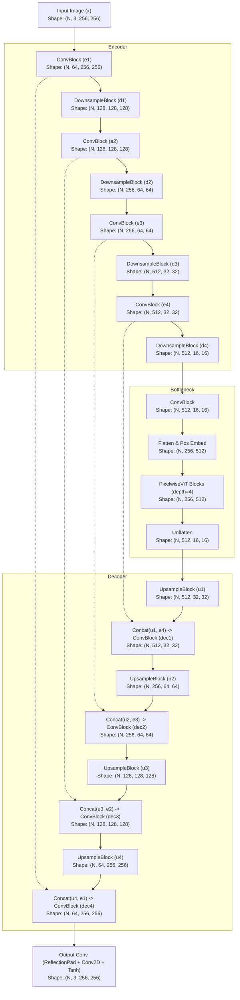
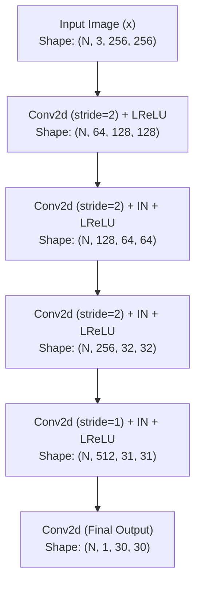
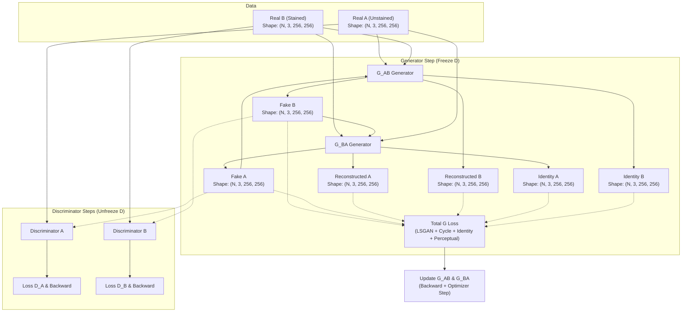
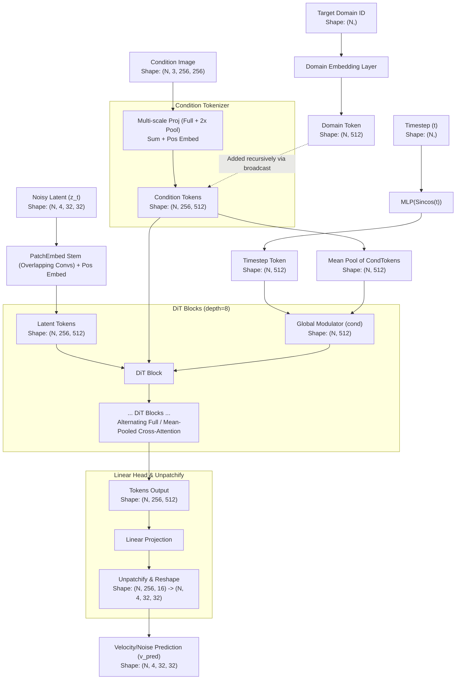
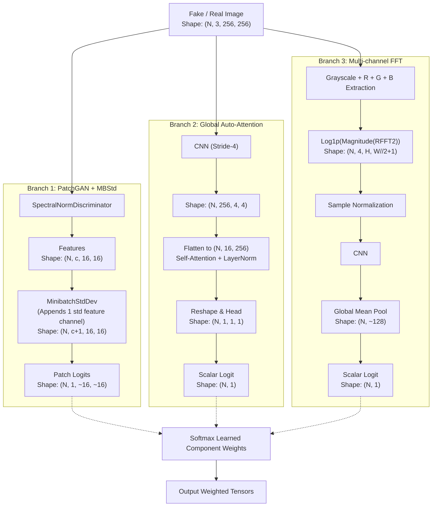
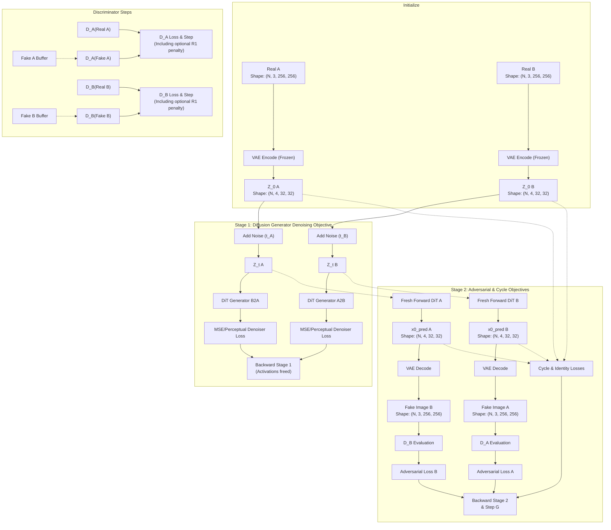

# Data Flow Diagrams

This document contains Mermaid data-flow diagrams for the Generator, Discriminator, and Training loops of **model_v1** and **model_v3**. Each component includes annotations for the tensor shapes passing between major operational blocks.

## Model V1

### 1. Generator (`ViTUNetGenerator`)
The v1 generator follows a U-Net backbone design with a pixel-wise Vision Transformer bottleneck.

### 2. Discriminator (`PatchDiscriminator`)
Standard PatchGAN identifying overlapping patches as real or fake.

### 3. Training Loop
A standard unidirectional CycleGAN iteration with AMP and Gradient Scaling.

---

## Model V3

### 1. Generator (`CycleDiTGenerator` --> `DiTGenerator`)
A unified latent Diffusion Transformer (DiT) architecture driven by full and multi-scale conditioning tokens.

### 2. Discriminator (`ProjectionDiscriminator`)
A composite 3-branch discriminator that addresses patches, global scale, and frequency domain. The output logits are scaled by learned normalisation weights.

### 3. Training Loop
The per-batch diffusion process separates the generator update into a diffusion state and an adversarial stage specifically to ease VRAM usage.

