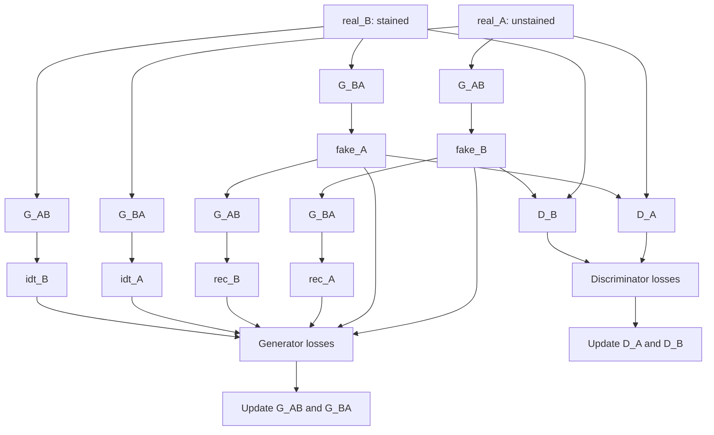

# Model V1 Dataflow Pipeline

Model v1 is the hybrid CycleGAN/UVCGAN baseline for unpaired virtual staining. It uses two generators, two discriminators, replay buffers, and CycleGAN-style multi-term losses.

## End-to-End Pipeline Diagram

## Training Dataflow

1. Load unpaired batches `real_A` and `real_B` from the shared data loader.
2. Run forward translation in both directions:
   - `fake_B = G_AB(real_A)`
   - `fake_A = G_BA(real_B)`
3. Run cycle reconstructions:
   - `rec_A = G_BA(fake_B)`
   - `rec_B = G_AB(fake_A)`
4. Run identity passes:
   - `idt_A = G_BA(real_A)`
   - `idt_B = G_AB(real_B)`
5. Compute generator objective from adversarial + cycle + identity + perceptual terms.
6. Compute discriminator objectives for `D_A` and `D_B` using real and buffered fake samples.
7. Apply optimizer steps with AMP scaler support.
8. Periodically save checkpoints, validation images, metrics, and CSV history.

## Files in This Model

- [generator.md](generator.md) - v1 generator architecture and block flow
- [discriminator.md](discriminator.md) - v1 discriminator design and outputs
- [losses.md](losses.md) - v1 generator/discriminator loss composition
- [training_loop.md](training_loop.md) - epoch/batch orchestration and training utilities
