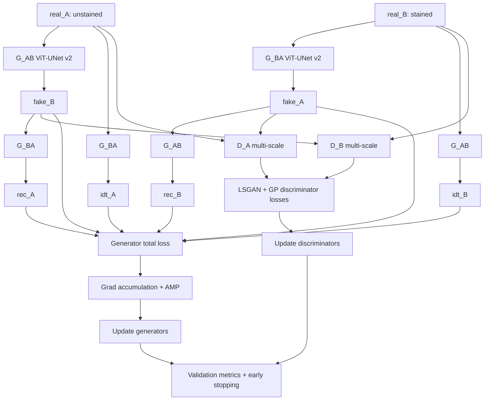

# Model V2 Dataflow Pipeline

Model v2 is the true UVCGAN implementation with improved generator/discriminator structure, configurable training, gradient accumulation, and robust validation/early stopping.

## End-to-End Pipeline Diagram

## Training Dataflow

1. Read unpaired `real_A` and `real_B` mini-batches.
2. Discriminator stage:
   - freeze generators
   - generate `fake_A/fake_B` under `no_grad`
   - compute `loss_D_A` and `loss_D_B`
   - update discriminators
3. Generator stage:
   - freeze discriminators
   - compute forward translation, cycle, and identity outputs
   - compute generator composite loss from configured weights
   - apply gradient accumulation, clipping, and AMP-scaled update
4. Log per-batch and per-epoch metrics (losses, grad norm, LR).
5. Run periodic validation and metrics computation (SSIM/PSNR/FID), then apply early stopping checks.
6. Save checkpoints and final testing artifacts.

## Files in This Model

- [generator.md](generator.md) - v2 generator internals and architectural changes
- [discriminator.md](discriminator.md) - v2 multi-scale discriminator details
- [losses.md](losses.md) - v2 objective terms and weighting
- [training_loop.md](training_loop.md) - full training orchestration
